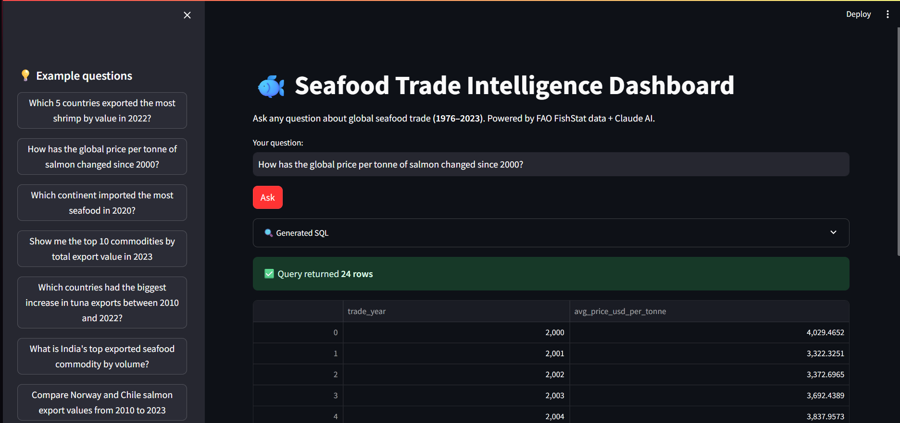

# 🐟 Seafood Trade Intelligence Dashboard

An end-to-end data pipeline and AI-powered query interface for global seafood trade data —
**1.2 million records, 200+ countries, 47 years of history** (FAO FishStat, 1976–2023).

> **Interview story:** *"I spent two years analysing seafood supply chains professionally, so I built a tool to track it at global scale — 1.2 million trade records, 200 countries, 47 years of data, all queryable in plain English."*

---

## 🚀 Live Demo

> 
> 

---

## 🏗️ Architecture

```
FAO FishStat CSVs
       │
       ▼
[Python Ingestion]  ──────────────────► BigQuery (fao_trade_raw)
       │                                   │
[GitHub Actions]                           │
(weekly refresh)                           ▼
                                    [dbt Core]
                                  Staging views
                                  Mart tables
                                       │
                          ┌────────────┴────────────┐
                          ▼                         ▼
                   [Power BI]               [Streamlit App]
                   Dashboard             Plain English queries
                                         via Claude API
```

| Layer     | Technology            | Purpose                                      |
|-----------|-----------------------|----------------------------------------------|
| Ingest    | Python + GitHub Actions | Weekly FAO data refresh                    |
| Store     | BigQuery              | Cloud data warehouse (free tier)             |
| Transform | dbt Core              | Star schema modelling, 12 data quality tests |
| Serve     | Power BI + Streamlit  | Dashboard + natural language query interface |
| Query     | Claude API (Anthropic)| Natural language → SQL                       |

---

## 📊 Sample Insights

- Norway and Chile account for **40%+ of global salmon export value** since 2000
- Global shrimp unit prices **increased 65%** between 2010 and 2022
- India's seafood exports **grew 8× by value** between 1990 and 2023

---

## 📂 Project Structure

```
seafood-trade-intelligence/
├── ingestion/
│   └── load_fao_data.py          ← Loads FAO CSVs into BigQuery
├── dbt_models/
│   ├── dbt_project.yml
│   └── models/
│       ├── staging/
│       │   ├── sources.yml
│       │   ├── stg_trade_value.sql
│       │   └── stg_trade_quantity.sql
│       └── marts/
│           ├── mart_trade_combined.sql   ← Main analysis table
│           ├── mart_top_exporters.sql
│           ├── mart_price_trends.sql
│           └── schema.yml               ← Data quality tests
├── app/
│   └── main.py                   ← Streamlit NL query interface
├── .github/
│   └── workflows/
│       └── weekly_pipeline.yml   ← Automated weekly refresh
├── requirements.txt
├── setup.sh
└── .env.example
```

---

## 🗄️ Dataset

| Property   | Detail                                        |
|------------|-----------------------------------------------|
| Source     | FAO Global Aquatic Trade Statistics (FishStat)|
| Coverage   | 200+ countries, 1,200+ commodity codes        |
| Time span  | 1976–2023 (47 years)                          |
| Size       | 1.24M quantity records + 1.25M value records  |
| License    | CC BY 4.0                                     |

---

## ⚙️ How to Run Locally

### Prerequisites

- Python 3.11+
- Google Cloud account with BigQuery enabled
- Anthropic API key ([console.anthropic.com](https://console.anthropic.com))
- FAO FishStat CSV files in `data/raw/`

### Setup

```bash
git clone https://github.com/YOUR_USERNAME/seafood-trade-intelligence
cd seafood-trade-intelligence
bash setup.sh
```

Fill in `.env` with your keys, add `credentials.json` from Google Cloud, then:

```bash
# 1. Load data into BigQuery (3–5 minutes)
python ingestion/load_fao_data.py

# 2. Transform with dbt
cd dbt_models
dbt debug      # verify connection
dbt run        # build all tables
dbt test       # run 12 data quality tests
dbt docs serve # browse lineage graph in browser

# 3. Launch the query app
cd ..
streamlit run app/main.py
```

Open [http://localhost:8501](http://localhost:8501) and ask:
> *"Which 5 countries exported the most shrimp by value in 2022?"*

---

## 🔑 GitHub Secrets Required

For the GitHub Actions pipeline, add these under **Settings → Secrets → Actions**:

| Secret             | Value                                          |
|--------------------|------------------------------------------------|
| `GCP_SA_KEY`       | Full contents of your `credentials.json` file  |
| `ANTHROPIC_API_KEY`| Your Anthropic API key                         |

---

## ✅ Skills Demonstrated

`BigQuery` · `dbt Core` · `Python` · `Streamlit` · `Claude API` · `GitHub Actions` · `SQL` · `ETL/ELT` · `Star Schema` · `Data Quality Testing`

---

## 📄 License

Data: [CC BY 4.0](https://creativecommons.org/licenses/by/4.0/) — FAO FishStat
Code: MIT

*fao.org/fishery/statistics-query/en/trade*
